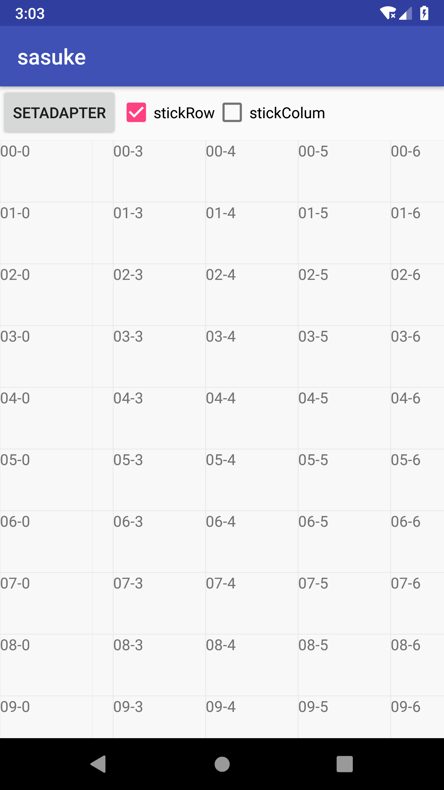

[](https://jitpack.io/#hotstu/sasuke)
# sasuke表格库
a pure simple table-grid view implementation based on RecyclerView
基于recyclerview的组合自定义view
原理和scrollablepanel一样，进行了优化，例如使用merge减少嵌套



## How to use

1. Add the JitPack repository to your build file 
```
	allprojects {
		repositories {
			...
			maven { url 'https://jitpack.io' }
		}
	}
```
2. Add the dependency
```
	dependencies {
	        implementation 'com.github.hotstu:sasuke:1.0.0'
	}

```

<br/>

# License

Copyright 2018 hglf

Licensed under the Apache License, Version 2.0 (the "License");
you may not use this file except in compliance with the License.
You may obtain a copy of the License at

    http://www.apache.org/licenses/LICENSE-2.0

Unless required by applicable law or agreed to in writing, software
distributed under the License is distributed on an "AS IS" BASIS,
WITHOUT WARRANTIES OR CONDITIONS OF ANY KIND, either express or implied.
See the License for the specific language governing permissions and
limitations under the License.

<br/>
